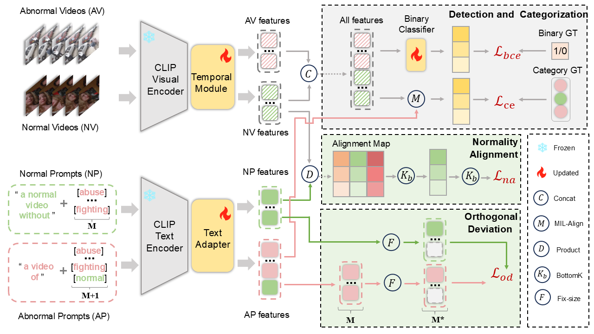

# Rethinking Open Vocabulary Video Anomaly Detection - Normality Matters
This is the official code of [Rethinking Open Vocabulary Video Anomaly Detection - Normality Matters]



---
## Setup
### Dependencies
Please set up the environment by following the `requirement.yml` file, using the command `conda env create -f requirement.yml`.

## Reproduce 

- Official Dataset Download
The original datasets for [UCF-Crime](https://www.crcv.ucf.edu/research/real-world-anomaly-detection-in-surveillance-videos/), [ShanghaiTech](https://github.com/StevenLiuWen/sRNN_TSC_Anomaly_Detection), [XD-Violence](https://roc-ng.github.io/XD-Violence/), and [UBnormal](https://github.com/lilygeorgescu/UBnormal?tab=readme-ov-file) can be obtained from their official sources.

- Extract the CLIP feature
    The extracted CLIP features for datasets can be obtained from [CLIP features](https://drive.google.com/drive/folders/10i7ZvL6gAB2FwEdD8_ILPgtiOpu5CZi9?usp=drive_link).

    You can also use the CLIP model to extract features by referring to the scripts under `./scripts/feature_extract`.

### Inference
To reproduce the inference results:
- After downloading the dataset features, change the parameter `cfg.feat_prefix`  in `src/configs_base2novel.py` to your dataset feature path.

- Change the test list path in `src/configs_base2novel.py`, to fully/base/novel test set. The 'All' option is set by default in configs_base2novel.py.


- [Download ckpt](https://drive.google.com/drive/folders/1xWK8V0OW58BtBSNQwUl338OLm6OY47kJ?usp=drive_link) and move the folder to your own `ckpt/` , then run following command

     ```
    cd src
    python main.py --mode infer --dataset ucf --test best_ckpt --device cuda:0
    ```
The `--dataset` option can be `ucf`, `sh`, `xd`, or `ub`, referring to UCF-Crime, ShanghaiTech, XD-Violence, or UBnormal. 

### Training
If you want to training in scratch, The following files need to be modified in order to run the code on your own machine:

- Change the settings as mentioned above, keep the test list path to fully test set.

- for ucf-crime run training command:
```
python main.py --mode train --dataset ucf  --test best_ckpt --seed 2 --device cuda:0
```
- for shanghaiTech run training command:
```
python main.py --mode train --dataset sh  --test best_ckpt --seed 1 --device cuda:0
```
- for xd-violence run training command:
```
python main.py --mode train --dataset xd  --test best_ckpt --seed 20 --device cuda:0
```
- for ubnormal run training command:
```
python main.py --mode train --dataset ub  --test best_ckpt --seed 1 --device cuda:0
```

### Ablation study
For ablation study inference, Change the test list path in `src/configs_base2novel.py`, to fully/base/novel test set, run the following command:
```
python main.py --mode infer --dataset ucf --test $TEST$ --device cuda:0
```
The corresponding `$TEST$` values and inference results are listed below:

| GAT | Adapter | $\mathcal{L}_{na}$ | $\mathcal{L}_{od}$ | AUC | AUC$_b$ | AUC$_n$ | TEST |
| :--: | :--: | :--: | :--: | :--: | :--: | :--: | :--: |
| × | × | × | × | 53.42 | 53.58 | 53.19 | `baseline` |
| ✓ | × | × | × | 83.76 | 88.72 | 80.22 | `w_GAT` |
| ✓ | ✓ | × | × | 85.43 | 93.95 | 86.84 | `w_GAT_adapter` |
| ✓ | ✓ | × | ✓ | 86.55 | 94.29 | 88.34 | `wo_Lna` |
| ✓ | ✓ | ✓ | × | 86.67 | 94.44 | 87.43 | `wo_Lod` |
| ✓ | ✓ | ✓ | ✓ | **86.93** | **94.71** | **88.62** | `full` |


For ablation study training, Change the test list path in `src/configs_base2novel.py`, to fully test set, run the following command:
- baseline (row 1)
```
python main.py --mode train --dataset ucf --test baseline --seed 2 --adapter False --temporal False --lamda2 0 --lamda3 0 --device cuda:0
```
- w_GAT (row 2)
```
python main.py --mode train --dataset ucf --test w_GAT --seed 2 --adapter False --temporal True --lamda2 0 --lamda3 0 --device cuda:0
```
- w_GAT_adapter (row 3)
```
python main.py --mode train --dataset ucf --test w_GAT_adapter --seed 2 --adapter True --temporal True --lamda2 0 --lamda3 0 --device cuda:0
```
- wo_Lna (row 4)
```
python main.py --mode train --dataset ucf --test wo_Lna --seed 2 --adapter True --temporal True --lamda2 1 --lamda3 0 --device cuda:0
```
- wo_Lod (row 5)
```
python main.py --mode train --dataset ucf --test wo_Lod --seed 2 --adapter True --temporal True --lamda2 0 --lamda3 2 --device cuda:0
```
- full (row 6)
```
python main.py --mode train --dataset ucf --test full --seed 2 --adapter True --temporal True --lamda2 1 --lamda3 2 --device cuda:0
```


## Acknowledgements

This project is built upon and inspired by several projects and prior works. 

- [AA-CLIP](https://github.com/Mwxinnn/AA-CLIP)
- [PLOVAD](https://github.com/ctX-u/PLOVAD)

## License

This repository is released under the [MIT License](./LICENSE).


## Citation

If you find this repository useful for your research, please consider citing our paper:

```bibtex
@inproceedings{your2026normality,
  title     = {Rethinking Open Vocabulary Video Anomaly Detection - Normality Matters},
  author    = {Deng, Yunhui and Wang, Hongxing},
  booktitle = {Proceedings of the International Conference on Pattern Recognition},
  year      = {2026}
}
```


